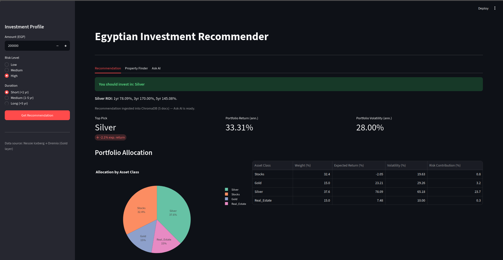
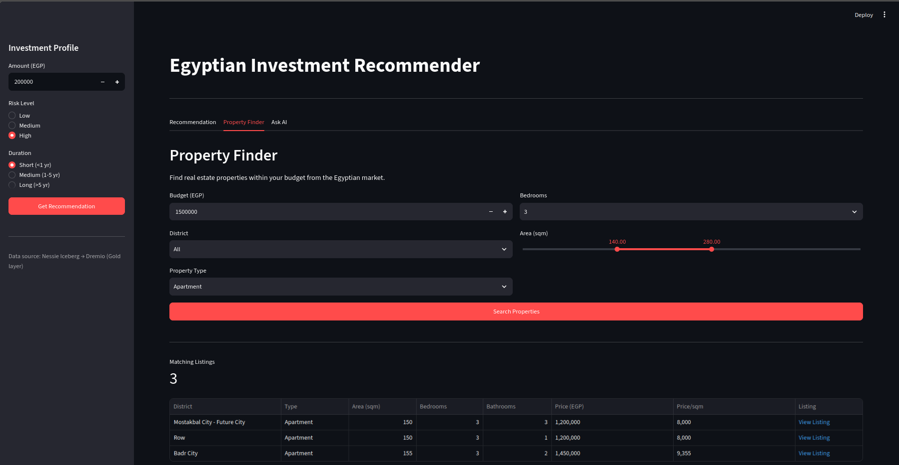
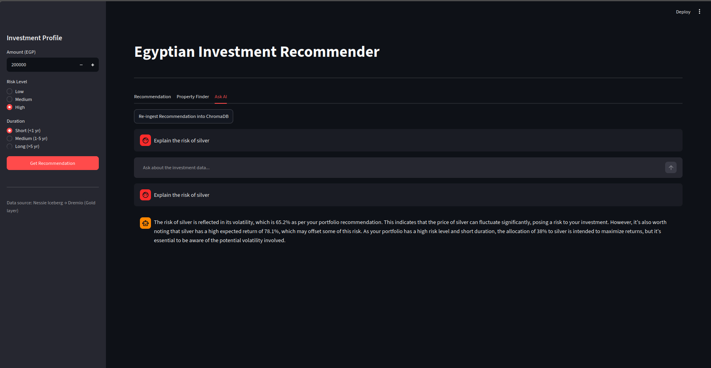

# Egyptian Investment Lakehouse

A personal data lakehouse built on **Apache Iceberg**, **Project Nessie**, **Apache Spark**, **Apache Airflow**, and **AWS S3** — designed to ingest, clean, and serve Egyptian investment data across equities, commodities, currencies, and real estate.

This repository covers my personal contribution to the [Egyptian Investment Intelligence Platform](https://github.com/): the full lakehouse foundation — storage, catalog, compute, orchestration, and query engine — plus a functional Streamlit application on top: a real-estate recommendation engine with a clear verdict, a property finder, and a RAG-based investment assistant, built on a production-grade open lakehouse stack.


> For the full table-by-table transformation logic (and the real bugs hit while building it), see [PIPELINE.md](PIPELINE.md). For connecting Dremio, see [DREMIO_SETUP.md](DREMIO_SETUP.md). For a presentation-ready overview of the whole pipeline, see [docs/OVERVIEW.md](docs/OVERVIEW.md). Recent fixes are recorded in [FIX_NOTES.md](FIX_NOTES.md).

---

## What This Project Does

Raw investment data from multiple Egyptian market sources is uploaded to **AWS S3**, cleaned and modeled by **Apache Spark** into **Apache Iceberg tables** (Silver → Gold), cataloged by **Project Nessie**, orchestrated by **Apache Airflow**, and queryable through **Dremio** for BI tools like Power BI and Grafana.

On top of that foundation sits a functional **Streamlit application** that reads the Gold layer through Dremio and answers the core question — *which asset should I invest in?* — with a clear **verdict banner** naming the best single investment, a full portfolio allocation, a **property finder**, and an **Ask AI assistant** that answers questions about the recommendation via a RAG pipeline scoped to the current recommendation.

### Data Sources

| File | Format | Description |
|---|---|---|
| `batch_eod_all_stocks.csv` | CSV | Daily OHLCV data for EGX-listed stocks |
| `EGX30_index.csv` | CSV | EGX30 benchmark index daily prices |
| `fundamentals_all.csv` | CSV | Company financials: P/E, MarketCap, Beta, EPS |
| `live_quotes_all.csv` | CSV | Real-time stock quotes with volume |
| `authority_prices.csv` | CSV | Historical LBMA gold & silver prices since 1968 |
| `spot_prices.csv` | CSV | Current gold & silver spot prices with bid/ask |
| `currency_rates.csv` | CSV | Exchange rates for world currencies |
| `aqarmap_data.json` / `propertyfinder_data.json` / `bayut_data.json` | JSON | Real estate **sale** listings scraped from 3 platforms |
| `rental_listings.csv` | CSV | Real estate **rental** listings, source-tagged and pre-combined |

---

## Architecture


> This diagram shows the full platform vision the team is building toward. **This repo implements the batch/lakehouse path** — S3, Spark, Iceberg, Nessie, Airflow, Dremio, the RAG pipeline, Streamlit, and Grafana — end to end. The Kafka/streaming-ingestion boxes describe planned real-time sources and are **not implemented** in this repo; every table in the Medallion Architecture section below is built from batch files via `ingestion/loaders/`.

```
Local data files (CSV, JSON)
         │  ingestion/loaders/  (boto3 upload, no Spark)
         ▼
  AWS S3 (raw/)                             ── "Bronze": raw files only, no Iceberg tables
         │
         ▼  Apache Spark + Apache Iceberg    (spark_jobs/silver/)
  Silver Layer  ── s3://<bucket>/silver/     ── cleaned, typed, deduped Iceberg tables
         │
         ▼  Apache Spark + Apache Iceberg    (spark_jobs/gold/)
  Gold Layer    ── s3://<bucket>/gold/       ── analytics marts + cross-asset scores
         │
    ┌────┴─────┬───────────────┐
    ▼          ▼               ▼
  Dremio   RAG Pipeline     Streamlit App
  Power BI  (ChromaDB +     (recommendation +
  Grafana    NVIDIA LLM)     property finder +
                             ask AI)
        │           │
        └────┬──────┘
             ▼
   RAG scope: current recommendation only

Orchestration: Apache Airflow (LocalExecutor, Spark in local mode inside the Airflow worker)
Catalog:       Project Nessie, backed by its own Postgres (JDBC2 version store)
App layer:     Streamlit (app/), served alongside api/ + frontend/ scaffolding (still empty)
```

**Catalog:** Project Nessie — Git-like branching for the Iceberg catalog, versioned via a dedicated Postgres
**Storage:** AWS S3 (bucket + region are per-deployment — see `.env`)
**Orchestration:** Apache Airflow — DAGs run the Spark jobs in local mode (no external Spark cluster)
**Query Engine:** Dremio — SQL interface for Power BI and Grafana

> **Note:** Bronze is intentionally *not* materialized as Iceberg tables. `ingestion/loaders/` just copies each local source file to `s3://<bucket>/raw/...` via a plain `boto3` upload — Silver jobs read those raw files directly. See [PIPELINE.md](PIPELINE.md) for why.

---

## Tech Stack

| Tool | Version | Role |
|---|---|---|
| Apache Spark | 3.5.3 | Data processing engine (local mode) |
| Apache Iceberg | 1.11.0 | Open table format |
| Project Nessie | 0.99.0 server / 0.108.3 Spark extensions | Iceberg catalog with Git-like branching |
| Apache Airflow | 2.9.3 | DAG orchestration for the Spark jobs |
| PostgreSQL | 16 | Airflow metadata DB + Nessie catalog store (separate instances) |
| Redis | 7 | Queue/cache backing for the app layer |
| AWS S3 | — | Data lake object storage |
| Dremio OSS | latest | SQL query engine + BI connectivity |
| ChromaDB | latest | Vector store for the RAG pipeline (`--profile rag`) |
| Streamlit | latest | Web app UI — recommendation, property finder, Ask AI |
| Python | 3.11 | App + RAG layer (`app/`) |
| NVIDIA NIM / LLM | hosted | Explanation layer behind the Ask AI assistant |
| Docker Compose | — | Container orchestration |

---

## Medallion Architecture

Full transformation-by-transformation detail (including known data-quality limitations and real bugs hit against the live stack) lives in **[PIPELINE.md](PIPELINE.md)**. Summary:

### Bronze — raw passthrough (`ingestion/loaders/`)

No Iceberg tables. Each loader uploads a local file as-is to `s3://<bucket>/raw/...`. Silver reads straight from there.

### Silver — `spark_jobs/silver/` (cleaned, typed Iceberg tables)

| Table | Source | Notes |
|---|---|---|
| `silver.stock_eod` | `batch_eod_all_stocks.csv` | Split/dividend-adjusted `adj_close`, `daily_return` |
| `silver.fx_rates` | `currency_rates.csv` | Filtered to EGP + majors (USD, EUR, GBP, JPY, CHF, CNY, SAR, AED) |
| `silver.metals` | `authority_prices.csv` + `spot_prices.csv` | Unified `history`/`spot` table, converted to EGP |
| `silver.fundamentals` | `fundamentals_all.csv` | Typed financials + derived `roe_proxy` |
| `silver.stock_quotes` | `live_quotes_all.csv` | Live per-ticker quote snapshot |
| `silver.egx30_index` | `EGX30_index.csv` | Typed OHLCV + `daily_return` |
| `silver.re_sales` | `aqarmap_data.json` + `propertyfinder_data.json` + `bayut_data.json` | Combined, deduped, `price_per_sqm_egp` derived |
| `silver.re_rentals` | `rental_listings.csv` | Normalized monthly rent in EGP, `for_recommendation_use = false` |

### Gold — `spark_jobs/gold/` (analytics marts)

| Table | Purpose |
|---|---|
| `gold.stock_returns_vol` | Full per-ticker daily panel: 3-month momentum, 90-day annualized volatility |
| `gold.stock_scores` | Cross-sectional 0–1 scores (ROE, dividend yield, volatility, liquidity, momentum) |
| `gold.gold_metal_roi` | Trailing 1/3/5/10-yr ROI for gold & silver, USD and EGP |
| `gold.re_sale_metrics` | District-level sale price/m² stats — **engine-eligible** (feeds the recommendation engine) |
| `gold.re_district_metrics` | Sale + rental district stats with `gross_yield_pct` — **dashboard-only** |
| `gold.asset_scores` | Cross-asset comparison: stocks vs. gold vs. silver vs. real estate — real-estate return = district `gross_yield_pct` + 4% annual appreciation, with a 10% assumed volatility (documented in the table's `*_label` columns) |
| `gold.market_snapshot` | Tidy long fact table: EGX30 index + metal spot + FX, one row per metric |


---

## Infrastructure Setup

### Prerequisites

- Docker Desktop installed
- AWS account with an S3 bucket for the Iceberg warehouse, and an IAM user with read/write access to it
- ~16 GB RAM recommended to run Spark + Airflow + Postgres + Dremio together

### Spark / Iceberg / Nessie JARs

No manual JAR download is needed. `spark_jobs/common/spark_session.py` resolves the matched Iceberg / Nessie-extensions / Hadoop-AWS / AWS-SDK versions via `spark.jars.packages` at session start, pinned to the `quay.io/jupyter/pyspark-notebook:spark-3.5.3` image's Spark/Hadoop build (see the version comment at the top of that file if the base image is ever upgraded).

### Environment Variables

Copy `env.example` to `.env` and fill in real values:

```env
AIRFLOW_UID=50000

# ---- AWS S3 (Iceberg warehouse) ----
AWS_ACCESS_KEY_ID=your_access_key
AWS_SECRET_ACCESS_KEY=your_secret_key
AWS_REGION=your_bucket_region
WAREHOUSE=s3://your-bucket/warehouse/

# ---- Nessie catalog ----
NESSIE_URI=http://nessie:19120/api/v2

# ---- Redis ----
REDIS_URL=redis://redis:6379/0

# ---- Jupyter ----
JUPYTER_TOKEN=egypt

# ---- Dremio ----
DREMIO_USER=admin
DREMIO_PASSWORD=admin123
DREMIO_FLIGHT_URI=grpc+tcp://dremio:32010

# ---- ChromaDB (rag profile) ----
CHROMA_URL=http://chromadb:8000

# ---- Grafana's analytics Postgres (postgres-grafana / exporter) ----
GRAFANA_PG_USER=admin
GRAFANA_PG_PASSWORD=admin123

# ---- LLM (explanation layer / RAG) ----
NVIDIA_API_KEY=your_nvidia_api_key

# ---- Scraping proxies (optional) ----
PROXY_URL=
```

> ⚠️ Never commit `.env` (or real credentials in `env.example`) to Git. `.env` is listed in `.gitignore`.
> Create the S3 bucket in AWS **first** (`aws s3 mb s3://your-bucket`) — Compose does not create it.

### Starting the Stack

```bash
# Core: Nessie + its Postgres, Jupyter/Spark, Dremio
docker compose up -d nessie jupyter dremio

# + Airflow (orchestration)
docker compose up -d postgres airflow-init airflow-webserver airflow-scheduler

# + RAG (optional)
docker compose --profile rag up -d

# + Streamlit app (recommendation / property finder / Ask AI)
docker compose up -d --build nessie-postgres nessie dremio chromadb streamlit

# + Grafana dashboards (exports Gold layer to Postgres, then starts Grafana)
docker compose --profile export up exporter
docker compose up -d postgres-grafana grafana grafana-image-renderer
```

> `api/` and `frontend/` are still empty scaffolding, so the full `--profile app` group is not runnable yet — start `streamlit` explicitly as above. The `app/Dockerfile` pre-seeds ChromaDB with the default ONNX embedding model (`all-MiniLM-L6-v2`) at build time, so the first Ask AI run doesn't need to download the ~80 MB model.

| Service | URL |
|---|---|
| Jupyter Notebook | http://localhost:8888 |
| Nessie API | http://localhost:19120/api/v2 |
| Dremio UI | http://localhost:9047 |
| Airflow UI | http://localhost:8082 |
| Streamlit App | http://localhost:8501 |
| ChromaDB | http://localhost:8003 |
| Grafana | http://localhost:3001 |
| API (planned) | http://localhost:8000 |
| Frontend (planned) | http://localhost:3000 |

---

## Running the Pipeline

### Via Airflow (implemented)

`dags/` has three DAGs, chained through Airflow's Dataset-scheduling (Airflow 2.9) rather than explicit cross-DAG dependencies — each stage triggers automatically once every dataset the next stage depends on has been updated:

| DAG | Trigger | What it does |
|---|---|---|
| `bronze_ingestion_dag` | `schedule="0 3 * * *"` (daily 03:00) | Runs all 6 `ingestion/loaders/` jobs in parallel — they're independent |
| `silver_transform_dag` | Fires once all 6 Bronze datasets have updated | Runs all 6 `spark_jobs/silver/` jobs, `max_active_tasks=2` (more concurrent Spark/JVM sessions than that exhausted the Airflow worker's memory in testing) |
| `gold_transform_dag` | Fires once all 8 Silver datasets have updated | Runs the 7 `spark_jobs/gold/` jobs in dependency order (`stock_scores` waits on `stock_returns_vol`, `asset_scores` waits on three upstream marts, etc.), also capped at `max_active_tasks=2` |

Start Airflow (see [Starting the Stack](#starting-the-stack) above) and the three DAGs run end-to-end on their own — no manual triggering needed once source files land locally.

### Manual / ad-hoc (for local debugging)

Each stage is also a standalone Python module, runnable inside the `jupyter` container or any environment with the project on `PYTHONPATH` and `.env` loaded — useful for iterating on a single job without spinning up Airflow. Order matters within Silver→Gold (see [PIPELINE.md](PIPELINE.md) for the full dependency graph):

```bash
# Bronze: upload raw source files to S3
python -m ingestion.loaders.load_stocks
python -m ingestion.loaders.load_egx_index
python -m ingestion.loaders.load_metals
python -m ingestion.loaders.load_fx
python -m ingestion.loaders.load_re_sales
python -m ingestion.loaders.load_re_rentals

# Silver: clean raw files into typed Iceberg tables (any order — none depend on another)
python -m spark_jobs.silver.clean_stocks_eod
python -m spark_jobs.silver.clean_fx
python -m spark_jobs.silver.clean_metals
python -m spark_jobs.silver.clean_fundamentals
python -m spark_jobs.silver.clean_re_sales
python -m spark_jobs.silver.clean_re_rentals

# Gold: analytics marts (order matters -- later jobs read earlier jobs' published tables)
python -m spark_jobs.gold.stock_returns_vol
python -m spark_jobs.gold.stock_scores
python -m spark_jobs.gold.gold_metal_roi
python -m spark_jobs.gold.re_sale_metrics
python -m spark_jobs.gold.re_district_metrics
python -m spark_jobs.gold.asset_scores
python -m spark_jobs.gold.market_snapshot
```

A data-quality gate (`spark_jobs/quality/`) is scaffolded — it's meant to validate each layer and, per its design, promote a run branch to `main` only on pass — but the check suites are stubs today, not yet enforced. Gold jobs (whether run via Airflow or manually) write straight to `main`.

---

## Streamlit App

The app (`app/`, port **8501**) reads the Gold layer through **Dremio** and has three tabs:

- **Recommendation** — pick your investment amount, time horizon, and risk tolerance, then get a portfolio allocation across stocks, gold, silver, and real estate, plus a bold **verdict banner** naming the single best asset and its best specific pick (e.g. the top-scoring property or stock) with the rationale behind it.
- **Property Finder** — explore real-estate districts: filter by city/district and sort by price per m², yield, and other metrics.
- **Ask AI** — a RAG assistant backed by ChromaDB + an NVIDIA LLM that answers questions about *the current recommendation*. Context is ingested automatically on every new recommendation (or via the "Re-ingest Recommendation" button), so the AI only ever talks about the recommendation in front of you.







> **Note:** the RAG pipeline intentionally ingests **only the recommendation result** (not the whole Gold layer) — see `app/rag/ingest.py::ingest_recommendation()`. The `app/Dockerfile` pre-seeds ChromaDB with the default ONNX embedding model at build time, so the first question doesn't trigger an ~80 MB model download.

---

## S3 Bucket Structure

```
s3://<your-bucket>/
├── raw/                    # Source files uploaded by ingestion/loaders/ (Bronze)
├── silver/                 # Iceberg tables — cleaned data
├── gold/                   # Iceberg tables — aggregated data
└── warehouse/              # Nessie/Iceberg internal metadata
```

---

## Connecting Dremio to Nessie

See **[DREMIO_SETUP.md](DREMIO_SETUP.md)** for the full one-time setup (admin account, adding the Nessie source, storage credentials). Quick reference:

1. Open Dremio at `http://localhost:9047`
2. **Add Source → Nessie**, endpoint `http://nessie:19120/api/v2`, authentication `None`
3. Add your S3 storage credentials under **Storage**
4. Query with `SELECT * FROM nessie.gold.stock_scores`, etc.

---

## Nessie Branching Workflow

Nessie branches can isolate in-development work from the main catalog (used while building out the Gold layer, and the intended mechanism for the quality gate once it's enforced):

```python
import requests

NESSIE = 'http://nessie:19120/api/v2'
hash_ = requests.get(f'{NESSIE}/trees/tree/main').json()['hash']

# Create a dev/run branch
requests.post(f'{NESSIE}/trees/branch', json={
    'name': 'gold-dev',
    'hash': hash_,
    'sourceRefName': 'main'
})

# Point Spark to the dev branch
# .config('spark.sql.catalog.nessie.ref', 'gold-dev')
```

Merge back to `main` only once the branch's tables are verified.

---

## Important Notes

- **Bronze has no Iceberg tables:** raw files land in `s3://<bucket>/raw/` and are read directly by Silver — there's no `bronze.*` namespace to query
- **S3A vs S3 paths:** `s3a://` for reading raw CSV/JSON files (Spark Hadoop filesystem); `s3://` for Iceberg table locations (Iceberg S3FileIO) — see `spark_jobs/common/io.py`
- **No AWS Glue:** Glue uses the Glue Data Catalog and is incompatible with the Nessie catalog used here
- **Dremio as intermediary for Power BI:** Power BI cannot read Parquet/Iceberg directly from S3, so Dremio is required as its query layer. Grafana does **not** go through Dremio — it reads from a dedicated `postgres-grafana` Postgres instance, populated by `scripts/export_to_postgres.py` (the `exporter` service) via a direct Spark JDBC write from Nessie/Iceberg (see [PIPELINE.md](PIPELINE.md))
- **`createOrReplace()` over SQL DDL:** Iceberg tables are created via the DataFrame API (`createOrReplace()`) rather than SQL `CREATE TABLE` statements, to avoid Nessie stale reference conflicts
- **DAGs are dataset-chained, not `>>`-chained across files:** `bronze_ingestion_dag` → `silver_transform_dag` → `gold_transform_dag` trigger each other via Airflow Dataset scheduling (each DAG's `schedule` is a list of the `Dataset` URIs the previous stage's tasks declare as `outlets`), not cross-DAG `TriggerDagRunOperator` calls — see the module docstrings in `dags/` for the exact dependency graph and the `max_active_tasks=2` memory-pressure workaround
- **`app/` is the functional application layer:** `app/engine/` (recommendation + property finder), `app/rag/` (Ask AI), and `app/streamlit_app.py` (UI) — served by the `streamlit` service
- **`api/` and `frontend/` are still empty scaffolding:** wired into `docker-compose.yml` (`--profile app`) but not yet implemented — the full profile can't run until they're built, so the app is started explicitly
- **RAG is scoped to the recommendation:** the Ask AI assistant ingests only the current recommendation result (`ingest_recommendation()`), not the whole Gold layer — re-ingested automatically on each new recommendation

---

## Project Context

This repository is my individual contribution to the **Egyptian Investment Intelligence Platform** — a team project combining a data lakehouse with a RAG-based investment recommendation engine. My scope covers the lakehouse foundation: raw ingestion, Iceberg table design (Silver & Gold), Nessie catalog management, Spark transformation jobs, Airflow orchestration, S3 storage architecture, and Dremio query layer setup — plus the functional **Streamlit app** (recommendation with a clear verdict, property finder, and Ask-AI RAG assistant) that consumes the Gold layer, with `api/` and `frontend/` left as scaffolding for a future dashboard.
